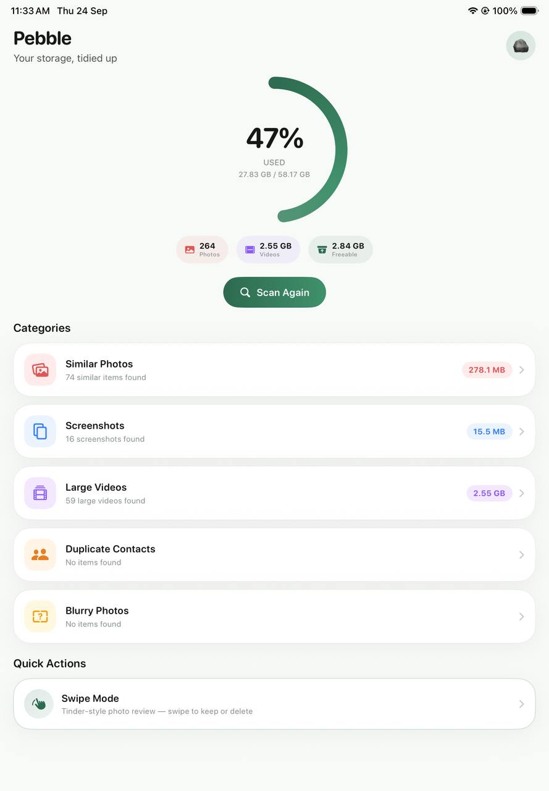
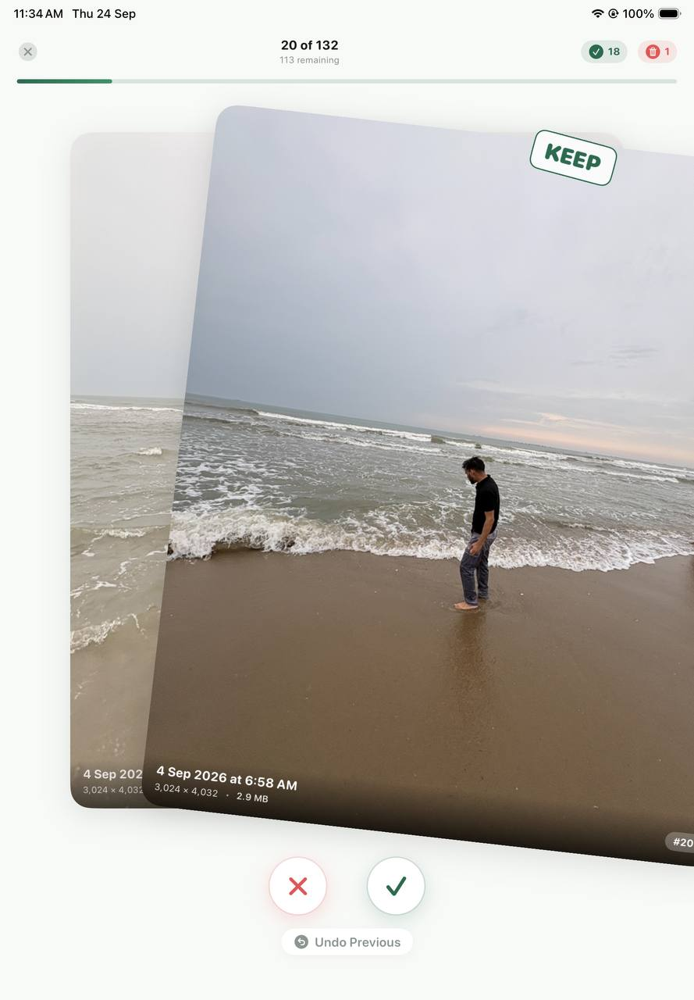
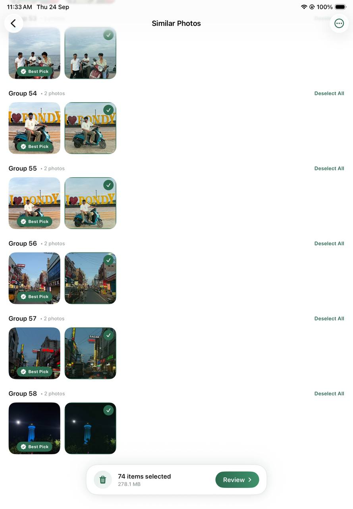
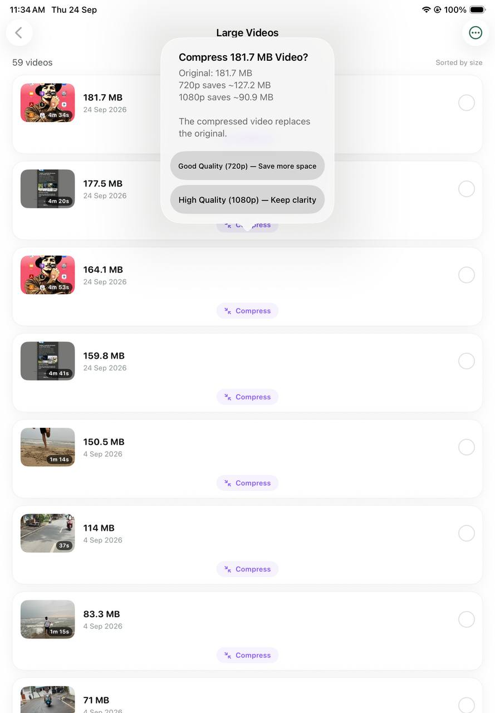
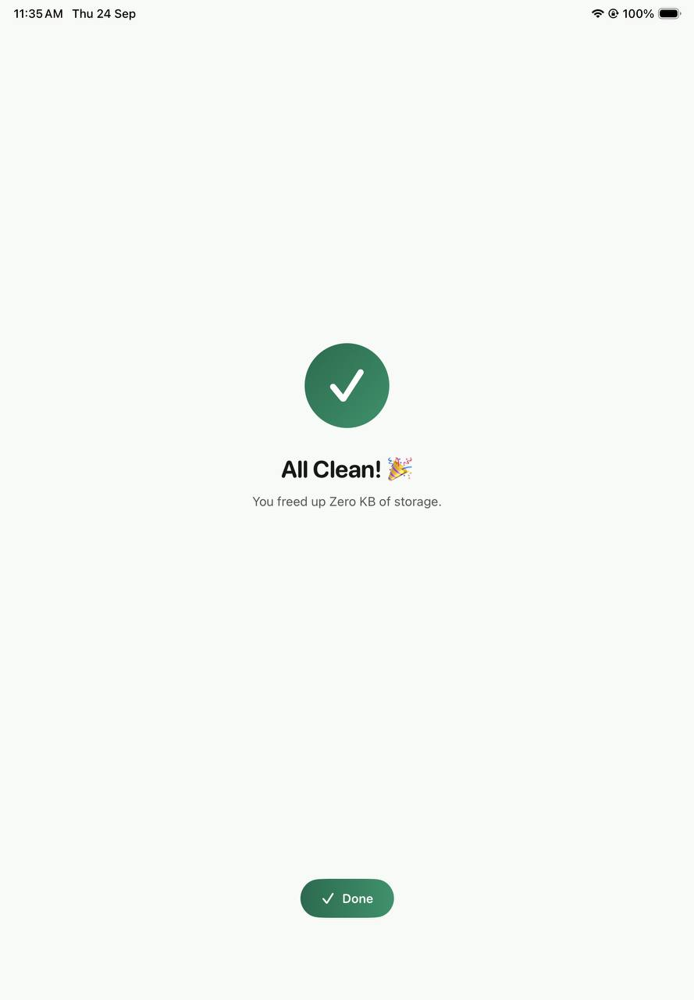

# Pebble

A calm, minimal, and 100% on-device storage cleaner for iOS.

Most phone cleaners on the App Store are bloated, push expensive weekly subscriptions, or secretly upload metadata to remote servers. Pebble was built as a clean alternative: fast, quiet, completely offline, and designed to feel right at home on iOS.

---

### Screenshots

<p align="center">
  
  
  
</p>

<p align="center">
  
  
</p>

---

### What it does

- **Smart Similar & Duplicate Detection**  
  Groups bursts, continuous shots, and duplicate photos using perceptual difference hashing (dHash) and timestamp proximity. Automatically picks the best shot in each group so you don't have to compare manually.

- **Swipe-to-Clean**  
  A Tinder-style swipe deck for clearing clutter fast. Swipe right to keep, left to discard. Haptics included.

- **Large Video Compression**  
  Finds heavy videos eating up gigabytes. Lets you compress them to 720p or 1080p right on your device, showing exactly how many megabytes you'll save before running.

- **Screenshots & Blurry Photo Finder**  
  Groups screenshots by month for bulk review and flags low-quality or blurry captures using Laplacian variance analysis.

- **Duplicate Contacts**  
  Finds duplicate contacts by phone, email, or exact name and merges them cleanly without losing details.

- **Safe by Default**  
  Nothing is deleted permanently without your consent. All removed media goes to iOS's built-in "Recently Deleted" album, giving you 30 days to recover anything if you change your mind.

---

### Privacy

- **Zero network requests.** Pebble doesn't have network permissions in its entitlements.
- **Zero third-party SDKs or trackers.**
- All hashing, blur analysis, and compression happen entirely on-device using Apple's native frameworks (`Accelerate`, `Vision`, `AVFoundation`).

---

### Tech Stack & Architecture

- **Language:** Swift 5.9+
- **UI:** SwiftUI (iOS 17+)
- **Media Processing:** `Photos`, `AVFoundation`, `Accelerate` (vImage)
- **Contacts:** `Contacts` framework
- **Project Setup:** Native Xcode project + optional `xcodegen` (`project.yml`)

---

### Getting Started

1. Clone the repository:
   ```bash
   git clone https://github.com/your-username/pebble.git
   cd pebble
   ```

2. Open in Xcode:
   ```bash
   open Pebble.xcodeproj
   ```
   *(If you prefer XcodeGen, run `xcodegen generate` to regenerate the project file).*

3. Select your development team under the **Signing & Capabilities** tab of the `Pebble` target.

4. Run on your physical iPhone or Simulator running iOS 17+.

---

### License

MIT
